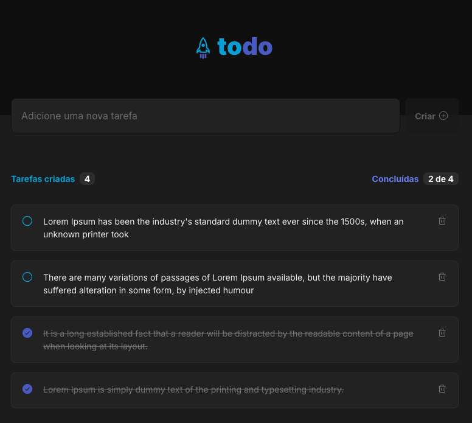

# To-Do List Project - Rocketseat Challenge

This project is part of a challenge from Rocketseat’s ReactJS course, where I developed a task management application in the style of a to-do list. The application allows you to:

- Add new tasks
- Mark and unmark tasks as completed
- Remove tasks from the list
- Track task completion progress

Although the functionalities are straightforward, the project was a great opportunity to reinforce key ReactJS concepts, such as:

- State management and immutability
- Working with lists and keys
- Passing props between components
- Componentization

Additionally, I chose to use TypeScript to ensure code safety and predictability, and SASS for greater flexibility in styling the application.

